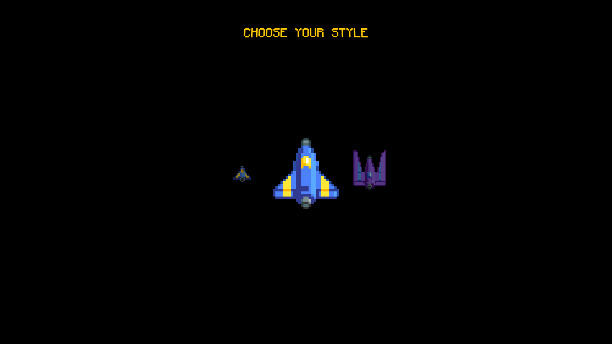
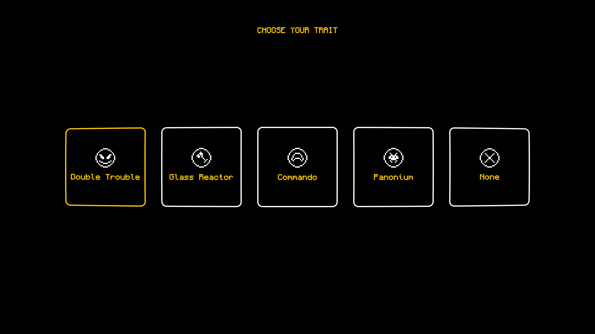
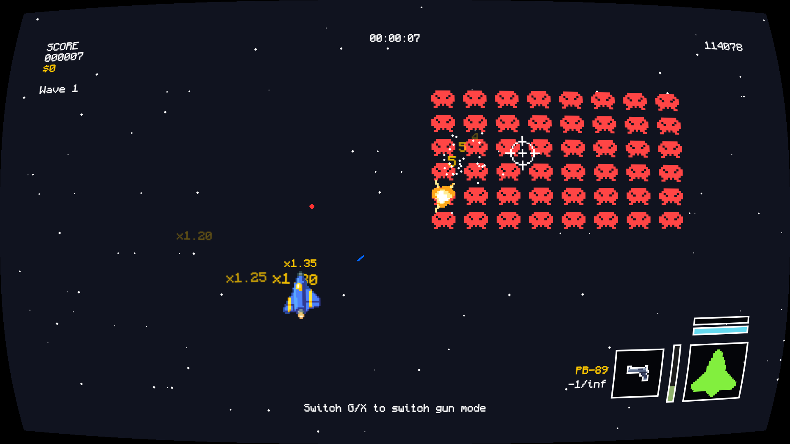
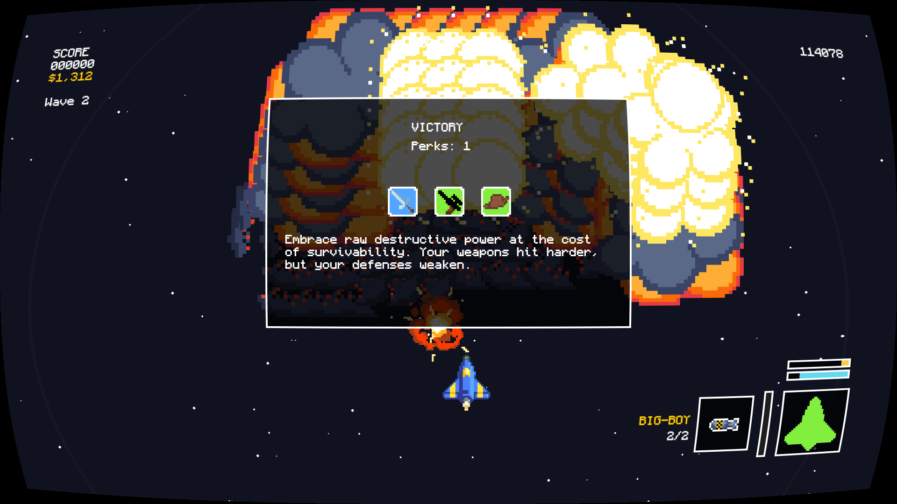

  

## Into the Astros!
You are a lone pilot that went on adventure once you reached adulthood. You 
decide to take the long way into the starfield and explore the galaxy.
But you... are not alone. Into the Astros! 🚀

**Astros** is a fast-paced 2D space shooter built with Python and Pygame, 
featuring dynamic combat, procedural encounters, skill progression, and hybrid input support 
(keyboard, mouse, and controller).

## Overview
### Ships, ships, and more... ships?

### Choose your gameplay!

### Engage in scaling rng'd combat!

### Reach the top, become a hero

#### 🔁 Repeat

## Controls
- WASD, Arrow Keys, or Controller
- Mouse/right joystick to move crosshair
- Mouse-Left/Spacebar/A/RB to shoot
- G/X to switch weapons
- Esc to pause
- R to restart when game over
- F2 to toggle debug mode
- F3/F4/right joystick to adjust HUD
- F5 to switch font
- Keypads' +/- and PLUS and MINUS/D-pad up and down to adjust volume
- F12/D-pad right to take screenshot